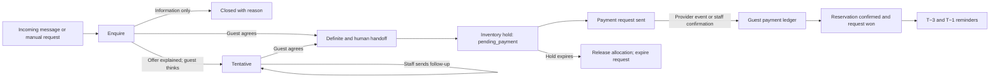

# Commercial journey

`leads.request_lifecycle` is the sales state. `lead_classifications` keeps quality, direction, temperature and probability independently. `request_lifecycle_history` records transitions. A tentative state creates or moves a `follow_ups` row and sets the next action. Staff preview and send it through `/api/crm/follow-ups/:id/preview` and `/send`; the follow-up closes only after outbound delivery is acknowledged.

`payment_requests` records a request for money. `guest_payments` records received money. A definite accommodation request holds an allocated unit with `reservations.status = pending_payment` and `hold_expires_at`; it remains unwon. The operator supplies a provider URL to `/api/crm/payment-requests/:id/send`. The webhook adapter or a staff member calls the appropriate `/received` endpoint. Both call `receivePaymentRequest`, which locks the row, records a single ledger payment, recalculates the folio and confirms the reservation only once the configured folio deposit is covered. If no deposit is required, booking confirms directly.

Quick manual booking uses the same hold and payment transition. It creates a linked request and folio, assigns a sellable unit, and shows the payment block in the reservation drawer. For a desk booking without a conversation, an employee can register a verified cash or bank transfer with a receipt reference from the draft payment request. The generic stay payment endpoint rejects `pending_payment` reservations so it cannot bypass confirmation rules.

Confirmation inserts a durable outbound message and T−3/T−1 `scheduled_outbound_messages`. A configured n8n worker polls `GET /api/integrations/communications/due`, calls `POST /api/integrations/communications/:id/deliver`, and periodically calls `POST /api/integrations/communications/expire-holds`. These endpoints use `x-crm-api-key`. The transport webhook must honor `idempotencyKey`. The same authenticated integration surface accepts `POST /payments/:id/received` after provider verification. Reservation reschedule cancels old pending reminders and creates new jobs; cancellation cancels them. Property directions and cancellation wording come from `property_knowledge` topics `directions_2gis` and `cancellation_policy`.

Outbound routing uses `conversation.channel`: Telegram retains `AGENT_OUTBOUND_WEBHOOK_URL` and `AGENT_OUTBOUND_WEBHOOK_TOKEN`; WhatsApp uses `WHATSAPP_OUTBOUND_WEBHOOK_URL` and `WHATSAPP_OUTBOUND_WEBHOOK_TOKEN`. Both provider adapters accept `guestra.<channel>.send_message` with the CRM message ID and idempotency key, then return `{ "ok": true, "externalMessageId": "..." }`. The browser never calls Telegram, WAHA or n8n directly.

The guest recognition modal aggregates the CRM bootstrap guest, notes, stays, reservations and folios. It is shared by the reservation drawer, quick booking dialog, Inbox, request detail and guest list. The commercial lifecycle block is shared by Inbox and request detail.

Request detail also loads `/api/crm/requests/:id/lifecycle-history` for a visible transition audit. The deterministic mock dataset includes enquiry, tentative, definite, pending payment, confirmed future booking, and Sultan Sovetov as a repeat guest with a live alert and visit history. Outbound actions require database mode and configured provider hooks; mock mode demonstrates the UI states.
